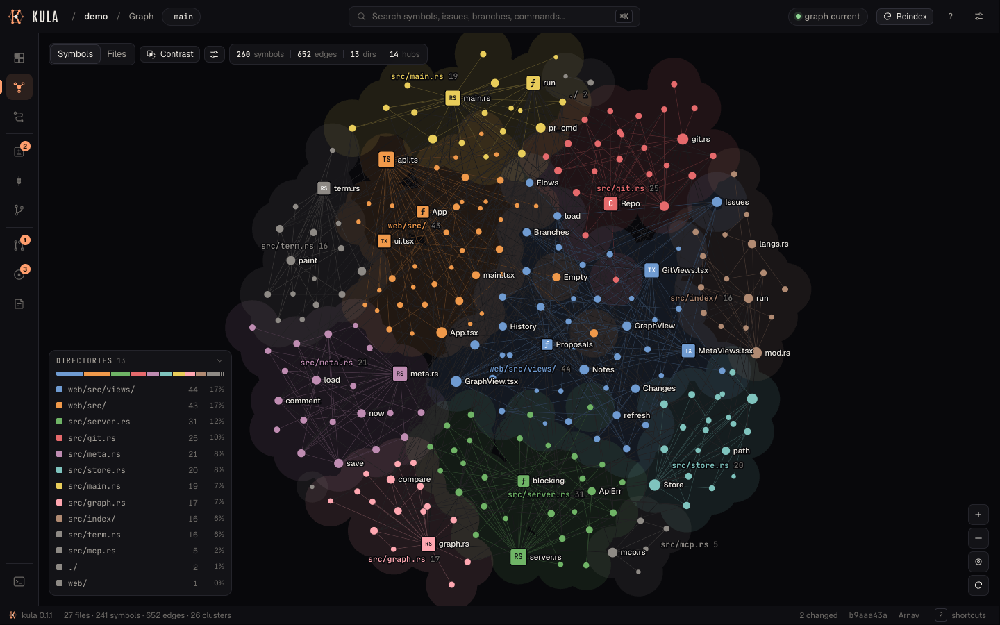
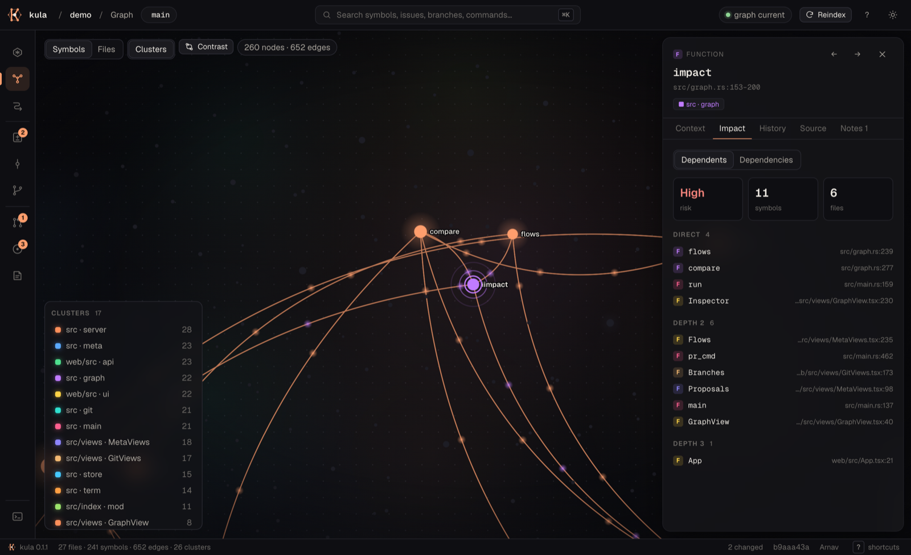
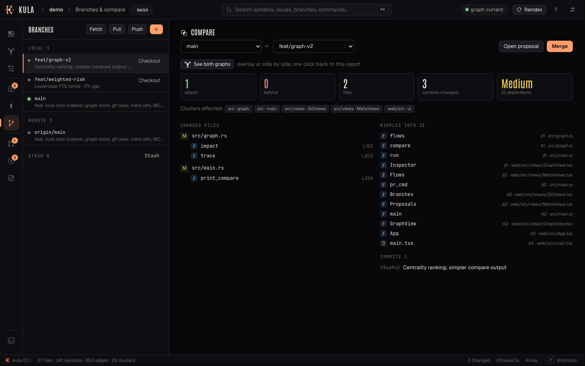
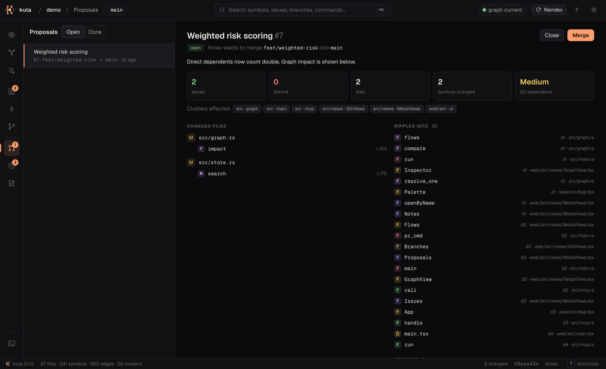
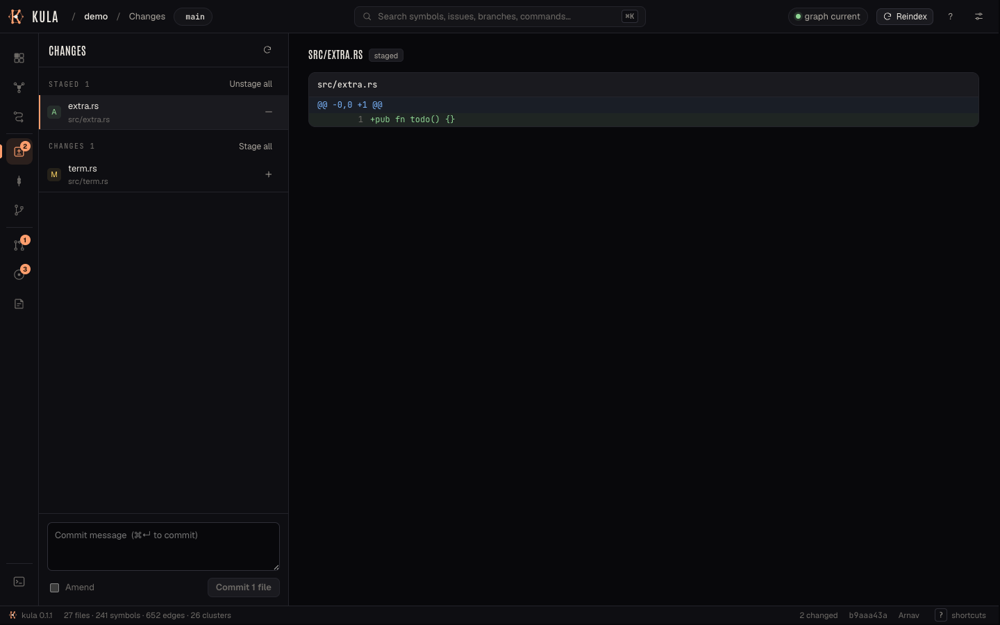
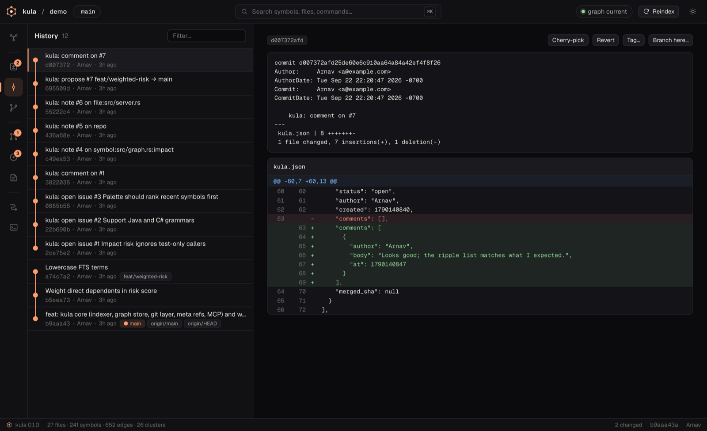
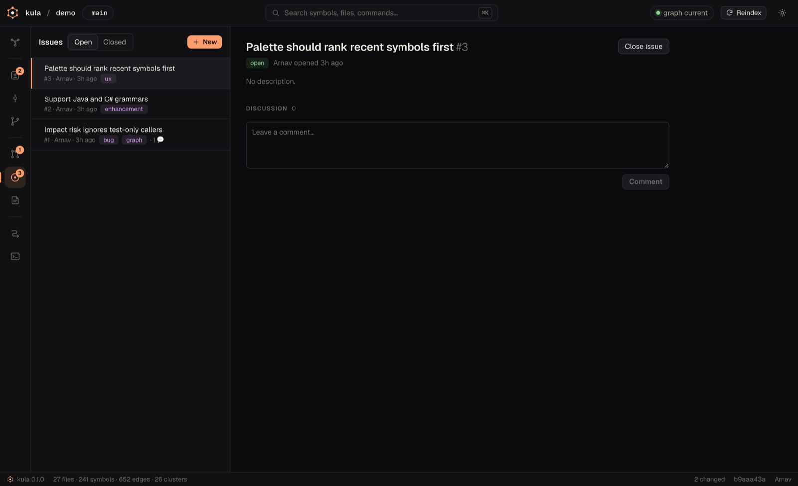
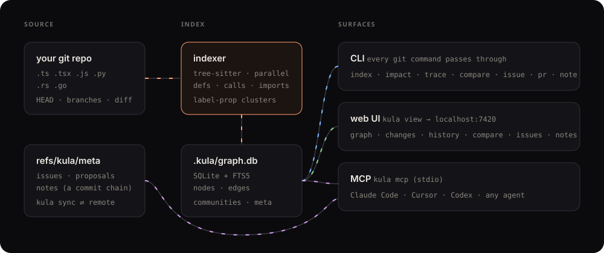

<p align="center">
  
</p>

<p align="center">
  <b>A local-first git client that turns your repository into a living knowledge graph.</b><br>
  Every git command · a graph of your code · issues, proposals &amp; notes stored in git · an MCP server for AI agents.<br>
  One binary. No server. No account.
</p>

<p align="center">
  <a href="#install">Install</a> ·
  <a href="#sixty-seconds">60 seconds</a> ·
  <a href="#the-ui">The UI</a> ·
  <a href="#commands">Commands</a> ·
  <a href="#for-ai-agents-mcp">MCP</a> ·
  <a href="#how-it-works">How it works</a> ·
  <a href="#development">Develop</a>
</p>

<p align="center">
  
  
  
  
</p>

---

## Why "kula"?

In the Trobriand Islands, the **kula ring** is a circuit of gifts. Shell necklaces travel one way around the islands and armbands travel the other. Nobody keeps them. Their value is the history of hands they have passed through. A commit works the same way: a sign whose meaning is its lineage. In Peirce's terms the code is the *sign*, the graph is its *object*, and your notes are the *interpretant*. Kula puts all three in one place, with the map drawn before you touch the code.

The logo is the ring itself: six nodes on a closed circuit around a centre.

## Install

Kula is a single static binary (about 11 MB) with the web UI embedded. Its only runtime dependency is `git`.

| Package manager | Command |
|---|---|
| **curl** (macOS, Linux) | `curl -fsSL https://raw.githubusercontent.com/A12N4V/kula/main/scripts/install.sh \| sh` |
| **Homebrew** | `brew install A12N4V/tap/kula` |
| **npm / pnpm / bun** | `npm i -g kula-cli` · `pnpm add -g kula-cli` · `bunx kula-cli` |
| **pip / uv / pipx** | `pip install kula` · `uv tool install kula` · `pipx install kula` |
| **cargo** | `cargo install kula` |
| **apt** (Debian, Ubuntu) | download `kula_*.deb` from [Releases](../../releases), then `sudo apt install ./kula_*.deb` |
| **nix** | `nix run github:A12N4V/kula` · `nix profile install github:A12N4V/kula` |

> [!NOTE]
> Registry packages are published by the release workflow on the first tagged release. Until then, build from source: `pnpm -C web install && pnpm -C web build && cargo install --path .`

## Sixty seconds

```bash
cd your-repo
kula index                 # build the knowledge graph  → .kula/graph.db
kula view                  # open the graph + git UI    → http://localhost:7420
kula impact parseConfig    # what breaks if I change this?
kula compare main feat/x   # graph-aware branch diff
kula commit -am "ship it"  # …and it's still just git
```

<p align="center"></p>
<p align="center"><sub>Illustrative session. Run it against your own repo for real numbers.</sub></p>

## The UI

`kula view` serves a local app at **localhost:7420**. It binds to `127.0.0.1` only and is protected by a per-session token.

<table>
<tr><td colspan="2">

<p align="center"><b>Graph.</b> Every function, class and file, clustered by what calls what. Hover to trace neighbours, click a cluster to isolate it. Rendered with WebGL, so thousands of nodes stay smooth.</p>
</td></tr>
<tr>
<td width="50%"><p align="center"><b>Impact.</b> The blast radius of any symbol, lit up on the graph and graded by risk.</p></td>
<td width="50%"><p align="center"><b>Compare.</b> Diff two branches at the symbol level and see what the change ripples into.</p></td>
</tr>
<tr>
<td><p align="center"><b>Proposals.</b> Pull requests that live in your repo: review thread, graph impact, merge.</p></td>
<td><p align="center"><b>Changes.</b> Stage per file, review diffs, commit or amend (<kbd>⌘</kbd><kbd>↵</kbd>).</p></td>
</tr>
<tr>
<td><p align="center"><b>History.</b> A lane graph of every branch, plus cherry-pick, revert, tag and branch-from-here.</p></td>
<td><p align="center"><b>Issues.</b> Labels, discussion, and anchors to the symbols they're about.</p></td>
</tr>
</table>

Also included: **Notes** (annotate the repo, a file, a symbol or a commit, with `[[symbol]]` links), **Flows** (execution paths traced from entry points), a **git console** (any non-interactive git command, in the browser), a <kbd>⌘K</kbd> **palette** that jumps to any symbol, number keys <kbd>1</kbd>–<kbd>9</kbd> to switch views, deep links (`#graph/<id>/impact`), and light, dark and system themes.

### Design principles

1. **The graph is home; git is the lens.** Commits, branches and proposals are filters on the map, not separate apps.
2. **Colour carries meaning.** Hue means cluster. Coral means focus or change. Red and amber only ever mean risk.
3. **Keyboard first.** Everything is reachable through <kbd>⌘K</kbd>, and every view has a number key.
4. **Honest status.** The top bar always says whether the graph matches `HEAD`.
5. **Motion explains cause.** Selecting a symbol dims everything that isn't connected to it. `prefers-reduced-motion` is respected everywhere.

## Commands

Kula is a **superset of git**. Any command it doesn't recognise goes straight to `git`, so `kula rebase -i`, `kula bisect` and `kula lfs pull` all work.

| | |
|---|---|
| `kula index` | Build or rebuild the knowledge graph |
| `kula view [-p PORT] [--no-open]` | Open the web UI |
| `kula status` | Branch, changes, and whether the graph is current |
| `kula lg [-n N]` | Pretty all-branch commit graph |
| `kula query <text>` | Fuzzy search over symbols and files (camelCase- and snake_case-aware) |
| `kula context <symbol>` | Callers, callees, container, cluster, notes |
| `kula impact <symbol> [--down] [-d N]` | Blast radius: dependents, or dependencies with `--down` |
| `kula trace <from> <to>` | Shortest call path between two symbols |
| `kula flows` | Execution flows from entry points |
| `kula clusters` | Functional communities |
| `kula compare <base> [head]` | Graph-aware branch diff |
| `kula issue new\|list\|show\|comment\|close\|reopen` | Local issues |
| `kula pr new\|list\|show\|comment\|merge\|close` | Proposals (local pull requests) |
| `kula note add\|list\|edit\|rm` | Notes on `repo`, `file:<path>`, `symbol:<name>`, `commit:<sha>` |
| `kula sync [remote]` | Share issues, proposals and notes through a normal git remote |
| `kula mcp` | MCP server over stdio |
| `kula doctor` | Environment check |

Every graph command accepts `--json`, and `-C <path>` works like git's.

## For AI agents (MCP)

`kula mcp` gives agents the graph as tools: `query`, `context`, `impact`, `trace`, `compare`, `flows`, `notes`, `issues`. Agents can check the blast radius before editing and read the notes your team left.

```jsonc
// Claude Code:  claude mcp add kula -- kula mcp
// Cursor / others (.mcp.json):
{ "mcpServers": { "kula": { "command": "kula", "args": ["mcp"] } } }
```

## How it works

<p align="center"></p>

- **Indexing.** Files are walked in parallel (respecting `.gitignore`) and parsed with tree-sitter. Kula extracts definitions (functions, methods, classes, interfaces), call sites and imports. Imports are resolved per language (relative JS/TS paths, Python packages, Rust `mod`/`use`, Go packages). Calls are resolved by preferring the same file, then imported files, then an unambiguous global match. A stoplist keeps generic names like `.get()` and `.map()` from creating false edges.
- **Clusters.** Weighted label propagation over calls, containment and imports. Each cluster is named after its dominant directory and its central class or file.
- **Storage.** `.kula/graph.db` is SQLite with FTS5. It is git-ignored automatically and rebuilt by `kula index`. A small codebase indexes in well under a second.
- **Issues, proposals and notes** live in one JSON document committed onto **`refs/kula/meta`**. Every change is a commit, so there is full history and nothing touches your branches. `kula sync` fetches, merges and pushes that ref through any git remote.
- **Git itself** is never reimplemented. Kula shells out to your `git`, so hooks, signing, credential helpers, LFS and your config all keep working.
- **Security.** The UI server listens on `127.0.0.1`, rejects foreign `Host` headers (which blocks DNS rebinding), requires a random per-session token on every API call, and validates revisions so they can't be read as git options.

**Language support today:** TypeScript/TSX, JavaScript/JSX, Python, Rust, Go. Adding a language takes a grammar crate plus a few tree-sitter patterns in [`src/index/langs.rs`](src/index/langs.rs).

## Development

```bash
pnpm -C web install && pnpm -C web build   # UI → web/dist (embedded at compile time)
cargo run -- view                           # run against this repo
pnpm -C web dev                             # hot-reload UI, proxies /api to :7420 (start `KULA_TOKEN=dev kula view --no-open` first)
./scripts/test.sh                           # everything; --quick skips packaging
```

`scripts/test.sh` is the single entry point used by CI:

| Stage | Checks |
|---|---|
| `web` | pnpm install · TypeScript typecheck · Vite production build |
| `rust` | rustfmt · clippy `-D warnings` · unit tests · end-to-end CLI tests against a polyglot fixture repo (TS, Python, Rust) |
| `e2e` | a real `kula view` server: token and Host guards, graph and impact API, stage and commit over HTTP, issues and notes, option-injection rejection |
| `pkg` | release build · npm launcher installed from packed tarballs · pip wheel via maturin, installed and run · crate includes the UI · Homebrew formula · installer · nix flake (when nix is present) |

```
src/
  main.rs        CLI (clap) + git passthrough
  git.rs         thin wrapper over the git binary
  index/         tree-sitter indexer + language registry
  store.rs       SQLite graph store + FTS search
  graph.rs       clusters · context · impact · trace · flows · compare
  meta.rs        issues / proposals / notes on refs/kula/meta
  server.rs      axum HTTP API + embedded UI
  mcp.rs         MCP stdio server
web/src/         React UI (sigma.js graph, Geist type)
packaging/       npm launcher · Homebrew formula
scripts/         test.sh · install.sh
```

**Releasing:** push a `vX.Y.Z` tag. [`release.yml`](.github/workflows/release.yml) builds 5 targets and publishes the GitHub release, `.deb` packages, PyPI wheels, npm packages, the crates.io crate and the Homebrew formula.

## Roadmap

- Incremental re-indexing on file change (`kula view --watch`)
- More languages: Java, C#, Kotlin, Swift, C/C++, Ruby, PHP
- Semantic search with optional local embeddings
- Two-way sync with GitHub and GitLab issues and PRs
- Time-travel graph: scrub through history and watch the architecture change
- Interactive rebase planner in the UI

## License

[MIT](LICENSE) © 2026 Arnav Sharma. Kula is an independent, clean-room project and contains no code from other code-graph tools.
