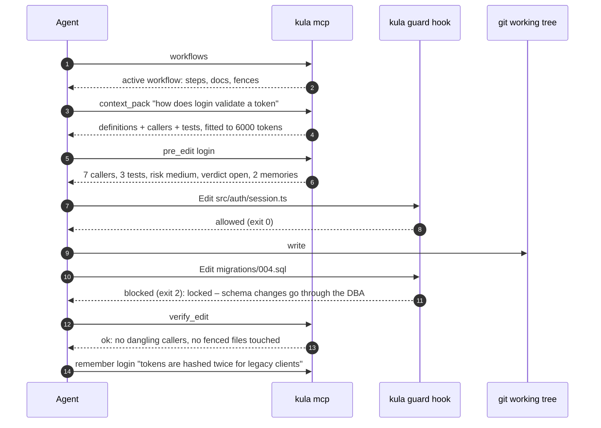
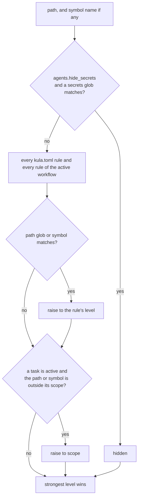
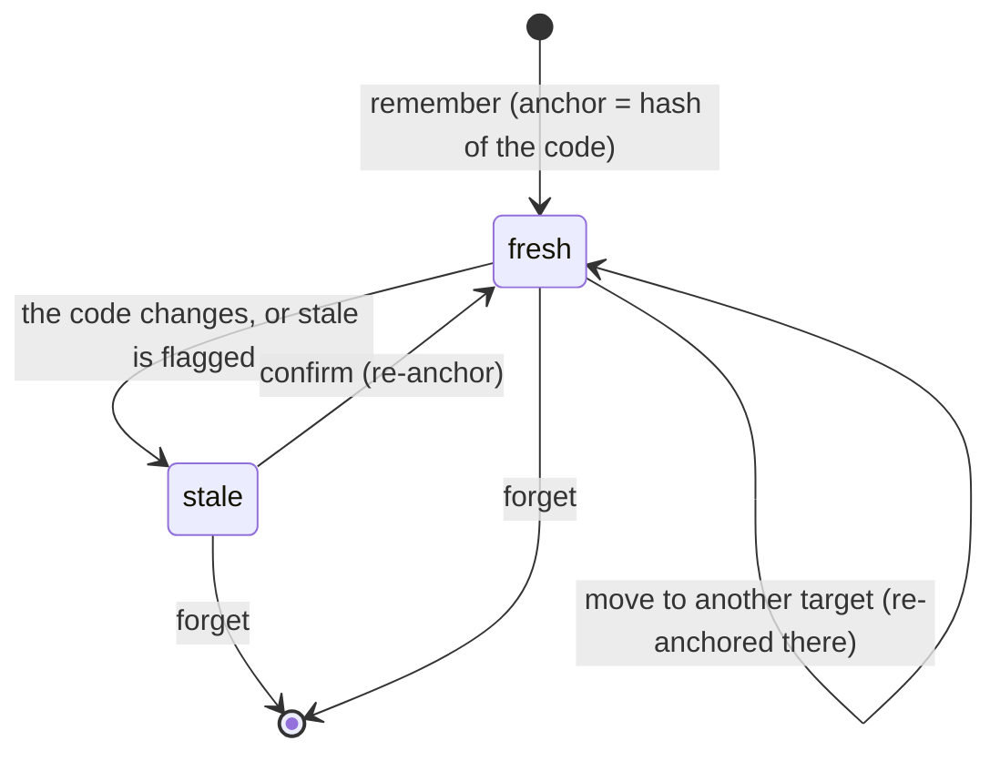

# Kula for AI agents

Kula gives an agent four things a coding agent does not have on its own: the repository as a graph it can query instead of grepping, **workflows** that say how a kind of work is done here, **fences** around code it must not change, and **memory** pinned to the code it describes. All four are enforced in one place (`src/guard.rs`) and read by every surface: the MCP server, the pre-edit hook, the CLI, the web UI and the CI gate.

- [Connecting an agent](#connecting-an-agent)
- [The agent loop](#the-agent-loop)
- [Workflows](#workflows)
- [Fences](#fences)
- [Tasks and scope](#tasks-and-scope)
- [Memory](#memory)
- [Instruction files and the brief](#instruction-files-and-the-brief)
- [Suggestions](#suggestions)
- [The pre-edit hook, per agent](#the-pre-edit-hook-per-agent)
- [MCP tool reference](#mcp-tool-reference)
- [What kula does not fence](#what-kula-does-not-fence)

## Connecting an agent

```sh
kula agents connect all          # or: claude cursor codex gemini
kula agents status               # which are wired up, which docs carry the brief
kula agents sync                 # write the brief into AGENTS.md (and CLAUDE.md / GEMINI.md when present)
```

| agent | MCP server | pre-edit hook | file(s) |
|---|---|---|---|
| Claude Code | `mcpServers.kula` | `PreToolUse` on `Edit\|MultiEdit\|Write\|NotebookEdit\|Read` | `.mcp.json`, `.claude/settings.json` |
| Cursor | `mcpServers.kula` | `preToolUse`, `beforeReadFile` | `.cursor/mcp.json`, `.cursor/hooks.json` |
| Codex | `[mcp_servers.kula]` | `PreToolUse` on `apply_patch\|Edit\|Write` | `.codex/config.toml`, `.codex/hooks.json` |
| Gemini CLI | `mcpServers.kula` | `BeforeTool` on `write_file\|replace\|read_file\|read_many_files` | `.gemini/settings.json` |
| anything else | `kula mcp` over stdio | – | AGENTS.md brief, `kula check` in CI |

Every write is a merge: kula reads the file, adds its own entry if it is missing, and leaves every other key, server and hook alone. Running `connect` twice changes nothing. `kula init` connects Claude Code plus any agent whose config directory (`.cursor`, `.codex`, `.gemini`) already exists.

## The agent loop

<p align="center"></p>



## Workflows

A workflow is a work mode: what kind of work this is, and the rules that come with it. Five ship built in; `[[workflow]]` tables in `kula.toml` add more, or replace a built-in by reusing its name.

| workflow | for | fences | memory |
|---|---|---|---|
| `explore` | read and explain the code; change nothing | locks `**` (everything) | write |
| `fix` | fix a bug with the smallest change that holds | – | write |
| `refactor` | restructure without changing behaviour | locks tests (`**/tests/**`, `**/*.test.*`, `**/*_test.*`, `**/*.spec.*`, …) | write |
| `tests` | write tests; leave the code under test alone | scope: tests only | write |
| `docs` | write documentation; no code changes | scope: `**/*.md`, `docs/**`, … | read |

Each workflow can carry:

```toml
[[workflow]]
name = "db-migrate"                        # letters, digits, - and _
about = "Schema changes, nothing else"
scope = ["migrations/**", "src/db/schema.rs"]  # default task scope: the only code agents may change
lock = ["src/db/pool.rs"]                  # read, never edit, while it runs
hide = ["fixtures/customers/**"]           # never shown
review = ["src/db/schema.rs:apply"]        # editable; a person reviews it
memory = "read"                            # write (default) · read: recall only · off
steps = [
  "Write the migration and its rollback",
  "pre_edit every symbol in src/db that reads the changed tables",
  "verify_edit; run the migration tests",
]
docs = ["docs/MIGRATIONS.md"]              # read before starting
```

A workflow does nothing until a task runs in it:

```sh
kula task start "add tenant_id to orders" --workflow db-migrate
```

From then on its fences sit on top of kula.toml's, its scope is the task's scope (unless `--scope` names another), its memory policy gates `remember` and `recall`, and its steps and docs are what the `workflows` tool returns. `kula task done` lifts all of it.

In the web UI, **Agents › Workflows** edits workflows (fences as chips with autofill, steps reorderable, memory as a switch), and **Preview fences** draws what a workflow would fence on the graph without starting it. On the graph itself, the fences legend (<kbd>f</kbd>) has a picker for the same preview.

## Fences

A fence is a `[[guard]]` rule in `kula.toml`:

```toml
[[guard]]
paths = ["migrations/**", "src/gen/"]      # gitignore-style; a bare directory means everything under it
symbols = ["charge_card", "src/pay.rs:refund"]  # a name, or path:name to pin one definition
level = "locked"
reason = "money moves here; a person changes it"   # told to the agent, verbatim
```

### Levels

| level | an agent may read | an agent may edit | in MCP answers | `kula check` |
|---|---|---|---|---|
| open | yes | yes | yes | – |
| review | yes | yes | yes, with the verdict | listed for a person |
| scope | yes | no | yes | – |
| locked | yes | no | yes, with the verdict | fails the gate |
| hidden | no | no | left out entirely | fails the gate |

### How a verdict is decided



The strongest level wins (`hidden > locked > scope > review > open`), so a task can only narrow what kula.toml allows, never widen it. Symbol rules follow the definition: `charge_card` fences that function wherever it moves. A symbol-scoped task (`--scope login`) opens the file that defines `login` for editing; in the hook, a file holding an in-scope symbol is in scope.

Likely secrets are hidden by default (`agents.hide_secrets = true`): `.env`, `.env.*`, `*.pem`, `*.key`, `*.p12`, `*.pfx`, `*.keystore`, `*.jks`, `id_rsa*`, `id_ed25519*`, `.npmrc`, `.pypirc`, `credentials.json`, `secrets/**`.

### Where the verdict is enforced

| surface | what happens |
|---|---|
| MCP | `query`, `context`, `impact`, `trace`, `context_pack`, `pre_edit`, `notes`, `recall` and `sparql` leave hidden code out; naming a hidden symbol is refused. `pre_edit` returns the verdict with advice. |
| pre-tool hook | blocks an edit to locked, hidden or out-of-scope code, and a read of hidden code, before it happens – from a file tool, a patch or a shell command; the reason goes back to the agent. |
| kula's own config | `kula.toml`, `.kula/`, `.mcp.json`, every agent's hook and MCP file, `.github/workflows/kula.yml` and `.git/` are locked for agents, whatever kula.toml says. Shell commands that would switch kula off – `kula task`, `kula team`, `kula agents accept`, `kula hooks uninstall`, `git commit --no-verify`, `git config core.hooksPath` – are refused. |
| git `pre-commit` | `kula guard commit` refuses a commit holding fenced changes when an agent makes it (`KULA_AGENT`, or the variable each agent sets for its shell: `CLAUDECODE`, `CURSOR_AGENT`, `CODEX_SANDBOX`, `GEMINI_CLI`). A person's commits pass. |
| `kula run` | any other harness: fenced files are read-only for the run, hidden ones unreadable, and anything fenced it changed anyway is put back afterwards (its version kept in `.kula/run/<time>/`). Exits 3 when it had to. |
| `verify_edit` / `kula verify` | lists edits to fenced code that got through (`guard_violations`); `ok` is false. |
| `kula check` | fails a branch that touches locked or hidden code; lists review code for a person. |
| RDF | hidden nodes are not in the graph `sparql` sees. |
| web UI | Agents › Fences, the inspector's guard badge, and the graph's fences overlay. |

## Tasks and scope

```sh
kula task start "speed up login" --scope "src/auth/**" login session.ts
kula task start "cover the parser" --workflow tests      # the workflow's scope applies
kula task show
kula task done
```

A scope entry is a path glob when it contains `/`, `*` or a `.`, otherwise a symbol name. The task lives in `.kula/task.json`, local to the checkout and never committed. Over MCP an agent can declare its own task with `start_task` – but only when none is active, so it can never replace a task a person started – and finish only a task an agent started.

## Memory

```sh
kula memory add login "tokens are hashed twice for legacy clients"
kula memory add file:src/db/pool.rs "the pool is sized for the read replica, not the primary"
kula memory recall login                 # its own, its file's, its callers' and callees', the repo's
kula memory recall --query "hashed"
kula memory edit 12 "tokens are hashed once since 2026-09" --target src/auth/token.rs:hash
kula memory stale 12                     # flag it without forgetting it
kula memory confirm 12                   # still true: re-anchor to the code as it is now
kula memory rm 12
```

A memory is a note with `kind: "memory"` on `refs/kula/meta`: in git, auditable, shared with `kula sync`. When it is written kula stores an **anchor**: a 64-bit FNV-1a hash of its target's source (the symbol's lines, or the whole file). Every recall recomputes the hash; if it differs, or the target is gone from the graph, the memory comes back with `stale: true`. Agents are told to verify a stale memory before relying on it.



Recall ranks by the graph, not by text similarity: the target itself (`self`), then its file (`file`), then direct callers and callees (`caller`, `callee`), then repository-wide memories (`repo`); a `--query` adds word matches. Within a rank, fresher and newer memories come first. A memory is at most 2000 characters – a fact, not a transcript – and cannot target hidden code.

Memory policy: `[agents] memory = false` turns agent memory off; a workflow's `memory = "read"` allows `recall` but not `remember`, and `"off"` allows neither. People are never gated: the CLI and the UI can always add, edit, retarget, flag, confirm and forget.

## Instruction files and the brief

Most agents read an instruction file on their own: `AGENTS.md` (Codex, Cursor, Copilot, Jules, Amp, Zed and most others), `CLAUDE.md` (Claude Code), `GEMINI.md` (Gemini CLI), `.github/copilot-instructions.md`. `kula agents sync` writes a **brief** into `AGENTS.md`, and into `CLAUDE.md` and `GEMINI.md` when they exist, between markers:

```md
<!-- kula:begin – written by `kula agents sync` from kula.toml; edit kula.toml, not this block -->
## Working here with kula
| when | MCP tool | shell |
…
### Fences
…
### Workflows
…
<!-- kula:end -->
```

Everything outside the markers is yours and is kept. The brief is generated from kula.toml, so an agent without MCP still knows the tools, the fences and the workflows; `kula agents status` and the UI's Docs tab say when a brief has fallen behind kula.toml. `[agents] docs = ["docs/ARCHITECTURE.md"]` points every agent at more docs; a workflow's `docs` point agents in that workflow at its own. The UI's **Agents › Docs** edits any of them in place.

## Suggestions

Agents may propose, never decide. The `suggest` MCP tool records a fence or a workflow in `.kula/suggestions.json` with the agent's reason; it appears under **Needs you** in the UI and in `kula agents suggestions`, and a person accepts it into kula.toml (`kula agents accept <id>`) or dismisses it. An agent that could loosen its own fences would not be fenced, so nothing an agent sends changes kula.toml directly.

## Teams

A team (`[[team]]` in kula.toml) names a workflow per agent. While it is at work (`kula team start <name>`, or Agents › Teams), every verdict is worked out for the agent asking – by `--agent` in the hook, `clientInfo` over MCP, `--agent` for `kula run` – so Claude Code can run an autoresearch loop while Cursor writes tests and Codex reads, each held to its own fences. A member's `scope` narrows its workflow's.

```toml
[[team]]
name = "ship"
about = "research, tests and review at once"
members = [
  { agent = "claude", workflow = "autoresearch", role = "speed up the indexer" },
  { agent = "cursor", workflow = "tests" },
  { agent = "codex", workflow = "explore", role = "review" },
]
```

## Autoresearch

A workflow with a `[workflow.research]` table is an experiment loop. `kula research start` measures a baseline (on a `research/<workflow>-<time>` branch unless `--here`) and opens a task in the workflow. Each `experiment` – the MCP tool, or `kula research try "<hypothesis>"` – takes the working tree's change as the experiment: if it touches anything fenced or out of scope it is reverted unrun; otherwise kula runs the metric, commits the change (`research #n: <hypothesis>`) if the number improved and restores the files if not. A metric that fails or prints no number counts as a failed experiment. The run's state is in `.kula/research/<workflow>.json`; the UI draws it under Agents › Research.

```toml
[[workflow]]
name = "autoresearch"
scope = ["src/index/**"]

[workflow.research]
metric = "cargo bench --bench index 2>&1 | grep -o '[0-9.]* ms' | tail -1"
goal = "min"          # min | max
budget = 40           # experiments; 0 for no limit
timeout = 600         # seconds per run of the metric
```

## Any harness

- **`kula run -w <workflow> --agent <name> -- <command>`** runs any agent CLI fenced for the run (see the table above), starting a task in the workflow and finishing it afterwards.
- **`kula workflow install <name>`** writes a workflow as each agent's own: a Claude Code subagent (`.claude/agents/kula-<name>.md`), a Cursor rule (`.cursor/rules/kula-<name>.mdc`) and a Gemini CLI command (`.gemini/commands/kula/<name>.toml`, run as `/kula:<name>`).
- **`kula workflow prompt <name>`** prints it as instructions for any system prompt.

## The pre-tool hook, per agent

`kula guard hook` reads one tool call as JSON on stdin and exits **0** to allow it or **2** to block it, with the reason on stderr. It understands each agent's payload:

| agent | payload kula reads | reply |
|---|---|---|
| Claude Code | `tool_name`, `tool_input.file_path` / `notebook_path`; `Bash` with `tool_input.command` | exit 2, reason on stderr |
| Cursor | `tool_input.file_path`, `file_path` for `beforeReadFile`, `command` for `beforeShellExecution` | exit 2, and `{"permission":"deny","agent_message":…}` on stdout (`--agent cursor`) |
| Codex | `tool_name: apply_patch`, the patch in `tool_input.command`: every `*** Add/Update/Delete File:` and `*** Move to:` path is checked; `shell` with `["bash", "-lc", "<script>"]` | exit 2, reason on stderr |
| Gemini CLI | `tool_name: write_file \| replace \| read_file \| run_shell_command`, `tool_input.file_path` / `absolute_path` / `command` | exit 2, reason on stderr |

Reads (`Read`, `read_file`, `read_many_files`, Cursor's `beforeReadFile`, or `--read`) are blocked only for hidden code; edits are blocked for hidden, locked and out-of-scope code. Paths outside the repository are not kula's to fence and always pass.

A shell command is split into its commands (`;`, `&&`, `|`) and each is read for what it writes – redirections (`>`, `>>`), `rm`, `mv`, `cp` and `install` targets, `touch`, `truncate`, `chmod`, `tee`, `dd of=`, `sed -i` and `perl -i`, `git rm`, `git mv`, `git checkout --`, `git restore` – and what it reads; a directory stands for every file in it. `--agent` also says who is asking, which matters when a team is at work.

```sh
echo '{"tool_name":"Edit","tool_input":{"file_path":"migrations/004.sql"}}' | kula guard hook; echo $?
# kula guard: migrations/004.sql is locked for agents – schema changes go through the DBA (kula.toml guard #1). …
# 2
```

## MCP tool reference

`kula mcp` speaks MCP over stdio (JSON-RPC 2.0, one message per line). The server's `instructions` tell the agent the loop above.

| tool | arguments | returns |
|---|---|---|
| `workflows` | – | every workflow (name, about, built in or not, research loop or not), the task, the active workflow in full, the agent's place in the active team, the docs that exist |
| `start_task` | `title`, `workflow?`, `scope?` | the task and its workflow; refused when a task is active |
| `finish_task` | – | the finished task; only one an agent started |
| `guards` | `paths?` | kula.toml's rules, the active workflow's rules, the task, whether secrets are hidden, a verdict per path |
| `context_pack` | `targets[]`, `budget?` (6000) | definitions plus what they use, who uses them, containers and tests, ranked by graph distance, big bodies cut to signatures |
| `pre_edit` | `symbol` | callers, total dependents, risk, tests that reach it, co-changing files, notes, the verdict, memories, advice |
| `verify_edit` | – | working tree vs `HEAD`: added, removed, modified symbols, dangling callers, callers to re-check, `guard_violations`, `ok` |
| `remember` | `target`, `text` | the memory, signed `agent:<client>` |
| `recall` | `target?`, `query?`, `limit?` | memories with `stale` and `via` |
| `update_memory` | `id`, `text?`, `target?`, `still_true?`, `stale?` | the memory; only memories agents wrote |
| `suggest` | `kind`, `why`, `guard?` or `workflow?` | the suggestion, waiting for a person |
| `research` | – | the autoresearch run: metric, goal, baseline, best, budget left, scope, every experiment |
| `experiment` | `hypothesis` | the experiment: the metric's value, kept (with its commit) or reverted, and why |
| `sparql` | `query`, `limit?` (200, max 2000) | rows, a boolean, or triples |
| `query` · `context` · `impact` · `trace` · `compare` · `graph_diff` · `flows` · `notes` · `issues` | as named | the graph |

The client name from the MCP handshake (`clientInfo.name`) signs everything an agent writes: `agent:claude-code`, `agent:cursor`, `agent:codex`.

## What kula does not fence

- **Programs that write files on their own.** The hook reads shell commands, not what a script or an interpreter (`python -c`, `node -e`, a build tool) does once it runs. `kula run` still puts fenced files back afterwards, the pre-commit hook refuses the commit, `verify_edit` reports it and `kula check` fails the branch; for hard isolation run agents in a sandbox or container as well.
- **Other checkouts.** Fences apply to the repository kula runs in.
- **People.** Fences are for agents. You can edit locked code; `kula check` still lists it, so review sees it.
