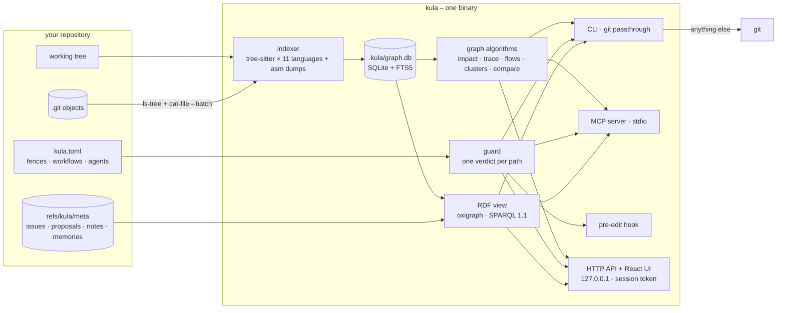
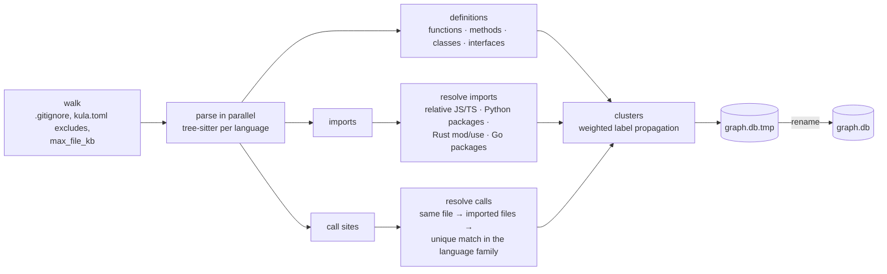

# Architecture

Kula is one Rust binary with the web UI embedded. It never reimplements git: everything that touches history shells out to your `git`, so hooks, signing, credential helpers, LFS and your config keep working. What kula adds is a graph of the code, kept beside the repository, and the surfaces that read it.



## Source layout

```
src/
  main.rs        CLI (clap), grouped help, git passthrough
  git.rs         the git binary: run, run_stdin, status, log, branches, exec_kula
  index/mod.rs   walk → parse → resolve imports and calls → cluster → store
  index/langs.rs language registry: grammars and tree-sitter patterns
  store.rs       SQLite graph store, FTS5 search, atomic publish
  graph.rs       communities, context, impact, trace, flows, compare, graph_diff
  meta.rs        issues, proposals, notes and memories on refs/kula/meta
  guard.rs       fences: levels, rules, secrets, tasks, the verdict
  workflow.rs    work modes: built-ins and [[workflow]] tables
  memory.rs      anchored memories: remember, recall, confirm, edit, stale
  agents.rs      connecting agents, instruction files and the brief, suggestions
  agent.rs       context_pack, pre_edit, verify_edit
  kg.rs          the graph as RDF, export and SPARQL
  mcp.rs         MCP stdio server
  server.rs      axum HTTP API and the embedded UI
  project.rs     init, hooks, deps, check
  config.rs      kula.toml: load, render, edit in place (toml_edit)
web/src/         React + sigma.js (WebGL) UI
```

## Indexing



- **Walk.** Files are walked with the `ignore` crate (respecting `.gitignore` and `kula.toml`'s `index.exclude`), skipping anything over `index.max_file_kb` (1024 by default).
- **Parse.** Each language is a tree-sitter grammar plus three pattern sets: definitions, calls and imports (`src/index/langs.rs`). TypeScript/TSX, JavaScript/JSX, Python, Rust, Go, Java, C, C++, C#, Ruby and PHP today, plus hand-parsed disassembly text (`src/index/asm.rs`: `.s`, `.asm`, `.objdump` → labels as functions, `call`/`bl` as calls, no imports; off with `[index] disassembly = false`). A unit test compiles every pattern against its grammar. Files in other languages are still walked, so kula works on any git repository.
- **Resolve.** A call resolves to a definition in the same file first, then in a file it imports, then to a unique definition of that name in the same **language family** (`js/ts/tsx`, `c/cpp`, or the language itself) – a TypeScript `confirm()` never lands on a Rust `confirm`. A stoplist of generic method names (`get`, `map`, `push`, `as_str`, `unwrap`, …) keeps `.get()` from wiring everything to everything. Rust macro invocations are not calls.
- **Cluster.** Weighted label propagation over calls, containment and imports, deterministic (stable order, ties broken by id). Each cluster is labelled by its dominant directory and its most central class or file.
- **Store.** The graph is written to `graph.db.tmp` and swapped in with one `rename`. A running `kula view` keeps reading the old file until the swap, so it never sees a half-built graph. Journal mode is `DELETE`, so there are no `-wal`/`-shm` files to truncate under open readers.

### The store

```sql
nodes(id, kind, name, path, lang, start_line, end_line, parent, community)
edges(src, dst, kind, weight)          -- CALLS · CONTAINS · IMPORTS
communities(id, label, size)
meta(key, value)                       -- indexed_head, stats, version
nodes_fts USING fts5(name, path)       -- camelCase and snake_case split before indexing
```

Search ranks an exact name first, then symbols before files and packages, then BM25 over name and path, and falls back to `LIKE` for fragments FTS cannot tokenise. `Store::freshness` compares `meta.indexed_head` with `HEAD` (an unborn `HEAD` counts as empty), which is how `kula status`, the UI's status bar and `kula index --if-stale` know whether the graph is current.

## Any revision, without a checkout

`graph-diff`, `compare`, Contrast in the UI and `verify_edit` need graphs of revisions that are not checked out. `snapshot(rev)` lists the tree with `git ls-tree -r`, streams every blob through one `git cat-file --batch`, and runs the same indexer over the bytes. Snapshots are cached per commit. `WORKTREE` means the files on disk.

Symbols are matched across two revisions by `(kind, path, container, name)` and compared by an FNV-1a hash of their source, so a moved line is not a change and a changed body is. Call edges are compared as `(caller, callee)` pairs on those identities.

## Impact and risk

`impact` walks `CALLS` and `CONTAINS` edges upstream (dependents) or downstream (dependencies) breadth-first to a depth (3 by default), recording each hit's distance and the clusters it lands in. Risk for one symbol:

| risk | when |
|---|---|
| none | nothing depends on it |
| low | a few dependents |
| medium | 5 or more direct callers, or 12 or more dependents |
| high | 40 or more dependents, or dependents in 5 or more clusters |

For a whole change (`compare`, `check`), every changed symbol's dependents to depth 4 are pooled: 10 or more symbols touched or 10 or more affected is medium, 40 or more affected is high.

`kula check` grades a branch against a base this way and exits 2 when the risk is above `check.max_risk`, or when any change touches locked or hidden code.

## Metadata in git: `refs/kula/meta`

Issues, proposals, notes and memories are one JSON document (`kula.json`) in a commit on `refs/kula/meta`. Every change writes a new blob with `git hash-object -w`, a one-file tree with `git mktree`, and a commit with `git commit-tree -p <previous>`, then moves the ref with `git update-ref`. Nothing touches your branches or index; the history of every issue and memory is `git log refs/kula/meta`; and `kula sync` fetches, merges and pushes the ref through any remote. Kula's own history views exclude `refs/kula/*`.

## Agents

`guard.rs` computes one verdict for a path or a symbol (see [AGENTS.md](AGENTS.md#how-a-verdict-is-decided)). It reads `kula.toml` (rules, secrets switch, workflows) and `.kula/task.json` (the task and its workflow) on each call, so a change to either applies at once to every surface without restarting anything. `memory.rs` stores anchors as FNV-1a hashes of a target's source and recomputes them on recall. `agents.rs` writes each agent's config as a JSON or TOML merge and generates the AGENTS.md brief from `kula.toml`.

Config edits from the UI go through `config::edit`, which parses `kula.toml` with `toml_edit`, replaces only the tables it owns (`[[guard]]`, `[[workflow]]`, `[agents]`), keeps every comment and table it does not touch, and refuses to write a file kula could not read back.

## The knowledge graph as RDF

`kg.rs` states the store as RDF on demand – nodes, edges, clusters, plus the notes, memories, issues and guards from `refs/kula/meta` and `kula.toml` – into an in-memory [oxigraph](https://github.com/oxigraph/oxigraph) store, and answers SPARQL 1.1 queries read only. Hidden code is left out before the store is built. See [KNOWLEDGE-GRAPH.md](KNOWLEDGE-GRAPH.md).

## The HTTP API and the UI

`kula view` serves the React UI and a JSON API on `127.0.0.1` (port 7420 by default).

- **Binding:** loopback only.
- **Host check:** requests whose `Host` is not `localhost`, `127.0.0.1` or `[::1]` are rejected, which blocks DNS rebinding.
- **Session token:** a random token is generated per run (or `KULA_TOKEN`), injected into the served HTML as a meta tag, and required as `x-kula-token` on every API call.
- **Revisions** are validated before they reach git, so a revision can never be read as an option.
- **Console:** the UI's terminal runs `kula` itself with `GIT_EDITOR=true`, `GIT_PAGER=cat` and `NO_COLOR=1`, and refuses interactive commands (`view`, `mcp`, `-i`).

The server polls `HEAD` and reindexes in the background when it moves; the UI polls `/api/repo` every five seconds and refreshes its views when the indexed head changes.

| group | routes |
|---|---|
| repository | `GET /api/repo` · `POST /api/index` · `GET /api/index/progress` · `GET /api/overview` |
| graph | `GET /api/graph` · `/api/search` · `/api/near` · `/api/symbol/{id}` · `/api/impact/{id}` · `/api/flows` · `/api/history/{id}` · `/api/file` |
| compare | `GET /api/compare` · `/api/graphdiff` |
| git | `GET /api/git/status` · `/api/git/log` · `/api/git/branches` · `/api/git/diff` · `/api/git/show/{sha}` · `POST /api/git/{action}` |
| meta | `GET /api/meta` · `POST /api/meta/{kind}/{action}` |
| agents | `GET /api/agents` · `POST /api/agents/{action}` · `GET /api/agent/pre_edit/{id}` · `/api/agent/verify` |
| knowledge graph | `POST /api/kg/sparql` · `GET /api/kg/export` · `/api/kg/examples` |

The UI is React with [sigma.js](https://www.sigmajs.org/) for WebGL rendering and graphology's ForceAtlas2 (in a worker) for layout. Directories are laid out as territories; the most connected symbols render as square tiles. In debug builds the binary serves `web/dist` from disk, so `pnpm -C web build` is enough to see a UI change.

## Tests

| layer | where | what |
|---|---|---|
| unit | `src/**` `#[cfg(test)]` | guard levels and workflows, hook payloads from every agent, the brief, kula.toml edits, IRIs, every tree-sitter pattern |
| CLI end to end | `tests/cli.rs` | a polyglot fixture repo: index, graph queries, compare, proposals, MCP round trips, init, deps, check, guards, tasks, workflows, connectors, suggestions, memory, RDF and SPARQL |
| server | `scripts/test.sh` (`e2e`) | a real `kula view`: token and Host guards, the API, staging and committing over HTTP, agents and SPARQL endpoints |
| UI | `web/e2e/ui.spec.ts` | Playwright on desktop, tablet and phone; a disposable seeded fixture (`web/e2e/fixture.sh`) for anything that writes |
| packaging | `scripts/test.sh` (`pkg`) | release build, npm launcher, pip wheel, crate contents, Homebrew formula, installer, nix flake |
