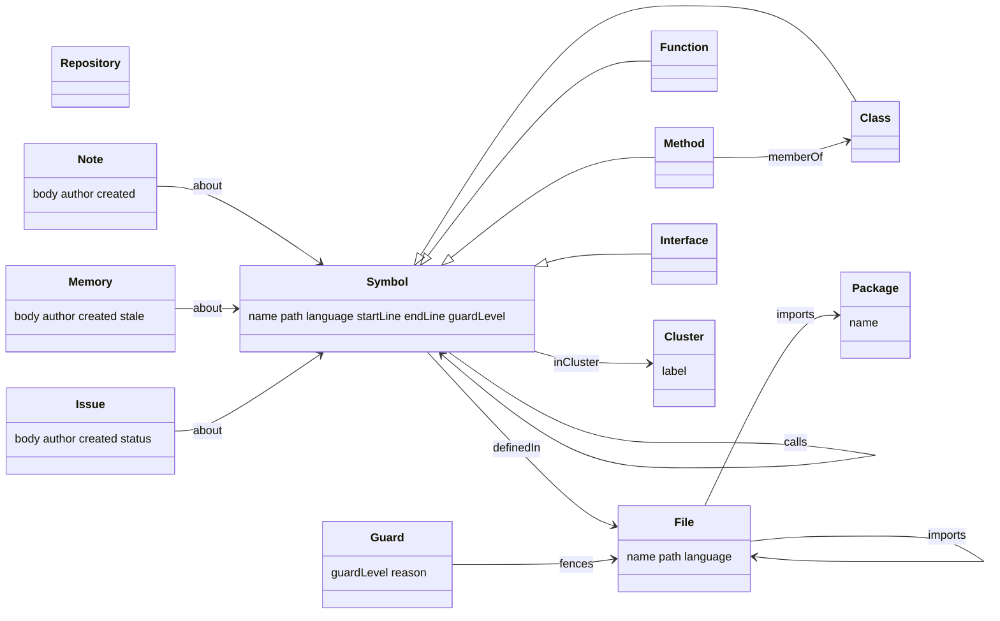

# The knowledge graph as RDF

`.kula/graph.db` is kula's working store: fast, and shaped for kula. The same graph is also stated as **RDF** under a small published vocabulary, so anything that speaks W3C standards can use it: export it as Turtle, N-Triples, JSON-LD or RDF/XML, load it into a triple store, or ask it questions in **SPARQL 1.1**. [Oxigraph](https://github.com/oxigraph/oxigraph) holds it in memory and evaluates queries. Queries are read only.

```sh
kula kg export -f ttl -o graph.ttl           # ttl · nt · jsonld · rdfxml
kula kg sparql 'ASK { ?m a kula:Memory ; kula:stale true }'
kula kg sparql @queries/hubs.rq --json       # a query from a file (or - for stdin)
kula kg examples                             # example queries and the vocabulary
```

Agents get the same endpoint as the `sparql` MCP tool, and people get it as the UI's **Query** view, where symbols and files in the results open in the map.

## Identifiers

Instances are `urn:kula:` IRIs (prefix `code:`), built from paths and names rather than row ids, so they are stable across reindexes and machines:

| thing | IRI |
|---|---|
| the repository | `code:repo` |
| a file | `<urn:kula:file:src/git.rs>` |
| a symbol | `<urn:kula:sym:src/git.rs#Repo.status>` (container-qualified) |
| a package | `<urn:kula:pkg:serde>` |
| a cluster | `code:cluster:3` |
| a note or memory | `code:note:12` |
| an issue | `code:issue:4` |
| a fence | `code:guard:1` (kula.toml order) |

Characters an IRI may not hold are percent-encoded; slashes and dots stay readable. Exports write instances as full IRIs, since paths do not survive as prefixed names.

## Vocabulary

`kula:` is `https://kula.dev/ns#`. Every term carries an `rdfs:comment` in the graph itself, so `SELECT ?t ?doc { ?t rdfs:comment ?doc }` lists it.



| class | meaning |
|---|---|
| `kula:Repository` | the repository; `code:repo` |
| `kula:File` | a source file, by repository-relative path |
| `kula:Symbol` | anything defined in code; every Function, Method, Class and Interface is one |
| `kula:Function` · `kula:Method` · `kula:Class` · `kula:Interface` | the kinds of symbol (Class covers structs, enums, records, types and modules; Interface covers traits and protocols) |
| `kula:Package` | an external package the code imports |
| `kula:Cluster` | a functional cluster: symbols that call each other more than they call the rest |
| `kula:Note` · `kula:Memory` | a person's note; an agent's memory, anchored to the code it was written about |
| `kula:Issue` | a local issue, stored in git |
| `kula:Guard` | a rule from kula.toml that fences code off from agents |

| property | from → to |
|---|---|
| `kula:name` · `kula:path` · `kula:language` | names, repository-relative paths, and one of rust, python, javascript, typescript, tsx, go, java, c, cpp, csharp, ruby, php |
| `kula:startLine` · `kula:endLine` | a definition's lines, 1-based |
| `kula:definedIn` | Symbol → its File |
| `kula:memberOf` | Method or nested symbol → its enclosing Class |
| `kula:calls` | Symbol → Symbol |
| `kula:imports` | File → File or Package |
| `kula:inCluster` · `kula:label` | Symbol or File → its Cluster; a cluster's label |
| `kula:about` | Note, Memory or Issue → the Repository, File or Symbol it is about |
| `kula:body` · `kula:author` · `kula:created` | text, a git user or `agent:<name>`, an `xsd:dateTime` |
| `kula:stale` | Memory: true when its code has changed since it was written |
| `kula:status` | Issue: open or closed |
| `kula:guardLevel` · `kula:reason` | File or Symbol → open, review, scope, locked or hidden for agents, and why |
| `kula:fences` | Guard → each File it covers |

Hidden code (fenced `hidden`, or a likely secret) is left out before the graph is built: it is not in exports, not in SPARQL results, and not reachable by IRI.

## Examples

Prefixes `kula:`, `code:`, `rdf:`, `rdfs:` and `xsd:` are predeclared.

```sparql
# The most-called symbols
SELECT ?name ?path (COUNT(?caller) AS ?callers) WHERE {
  ?s a kula:Symbol ; kula:name ?name ; kula:path ?path .
  ?caller kula:calls ?s .
} GROUP BY ?name ?path ORDER BY DESC(?callers) LIMIT 15
```

```sparql
# Functions no test reaches (by name)
SELECT ?name ?path WHERE {
  ?f a kula:Function ; kula:name ?name ; kula:path ?path .
  FILTER NOT EXISTS { ?t kula:calls ?f ; kula:path ?tp . FILTER(CONTAINS(?tp, "test")) }
  FILTER(!CONTAINS(?path, "test"))
} ORDER BY ?path LIMIT 50
```

```sparql
# Import cycles between two files
SELECT ?a ?b WHERE { ?a kula:imports ?b . ?b kula:imports ?a . FILTER(STR(?a) < STR(?b)) }
```

```sparql
# Stale memories, and what they were about
SELECT ?about ?body ?author WHERE {
  ?m a kula:Memory ; kula:stale true ; kula:body ?body ; kula:author ?author ; kula:about ?about .
}
```

```sparql
# Locked code that something outside its cluster calls
SELECT DISTINCT ?name ?caller WHERE {
  ?s kula:guardLevel "locked" ; kula:name ?name ; kula:inCluster ?c .
  ?x kula:calls ?s ; kula:name ?caller ; kula:inCluster ?d .
  FILTER(?c != ?d)
}
```

```sparql
# Which agents wrote what
SELECT ?author (COUNT(?m) AS ?memories) WHERE {
  ?m a kula:Memory ; kula:author ?author . FILTER(STRSTARTS(?author, "agent:"))
} GROUP BY ?author ORDER BY DESC(?memories)
```

## Result shapes

`kula kg sparql --json`, the MCP tool and `POST /api/kg/sparql` return:

| query | shape |
|---|---|
| `SELECT` | `{ "vars": ["name", "path"], "rows": [{ "name": "login", "path": "src/auth.ts" }], "truncated": false }` |
| `ASK` | `{ "boolean": true }` |
| `CONSTRUCT` · `DESCRIBE` | `{ "triples": [[subject, predicate, object], …] }` |

IRIs come back in `code:` form, literals as JSON strings, numbers and booleans. Rows are capped (200 by default over MCP, at most 2000; 500 in the UI) and `truncated` says when the cap was hit.
